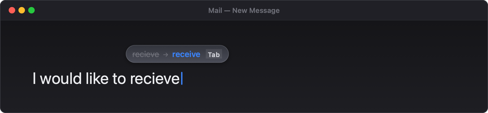
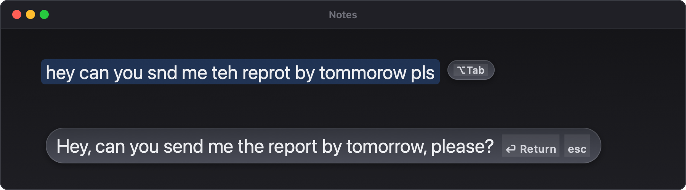
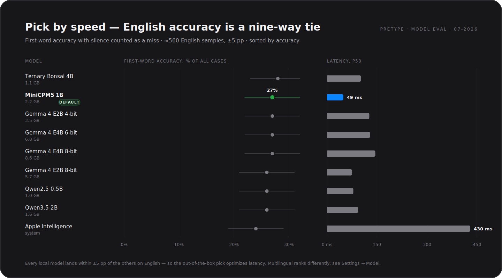
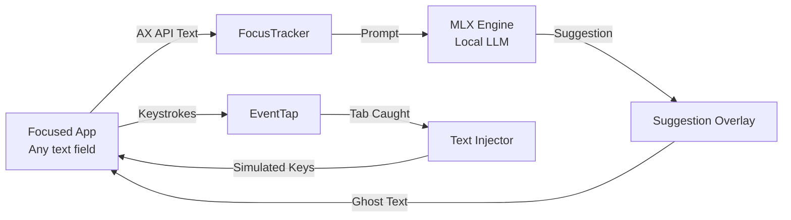

<div align="center">

<picture>
  <source media="(prefers-color-scheme: dark)" srcset="docs/pretype-logo-dark.png" />
  
</picture>

# Pretype

**System-wide AI autocomplete for macOS.**<br/>
Copilot-style suggestions in every text field — completely offline, private, and on-device.

[](https://pretype.app)
[](https://github.com/nikiomori/Pretype/releases/latest)
[](https://github.com/nikiomori/Pretype/actions/workflows/ci.yml)
[](LICENSE)
[](#requirements)
[](#requirements)
[](Package.swift)

<p>
  <a href="https://pretype.app"><b>Website</b></a> ·
  <a href="#quick-start"><b>Quick Start</b></a> ·
  <a href="#why-pretype"><b>Why Pretype</b></a> ·
  <a href="#features"><b>Features</b></a> ·
  <a href="#choosing-a-model"><b>Models</b></a> ·
  <a href="#how-it-works"><b>How it Works</b></a> ·
  <a href="#faq"><b>FAQ</b></a> ·
  <a href="#roadmap"><b>Roadmap</b></a> ·
  <a href="#contributing"><b>Contributing</b></a>
</p>

<a href="https://github.com/nikiomori/Pretype/releases/latest/download/Pretype.app.zip">
  
</a>

<br/><br/>


<sub>*Type anywhere → gray ghost text appears at the caret → press <kbd>Tab</kbd> to accept a word, or <kbd>⇧Tab</kbd> for the rest.*</sub>

</div>

---

> [!NOTE]
> **Pretype runs entirely on your Mac.** It runs a local LLM via Apple Silicon MLX (a ~2 GB default model picked to match your keyboard languages, with Gemma 4 and other models as options) or the Apple Intelligence system model. Your keystrokes never leave your machine — no subscriptions, no cloud, no tracking.

---

## Why Pretype?

Most autocomplete solutions live inside a single code editor and ship your text to remote servers. Pretype runs globally across macOS and processes everything locally.

| Feature | **Pretype** | Cloud Autocomplete |
| :--- | :---: | :---: |
| **Privacy** | **100% On-Device** (keystrokes never leave your Mac) | Sent to a remote server |
| **Scope** | **System-Wide** (works in Mail, Slack, Notes, Safari, etc.) | Usually locked to a single IDE / editor |
| **Cost** | **Free & Open-Source** (MIT License) | Subscription fees or API token costs |
| **Offline** | **Fully Functional** without internet | Requires active internet connection |
| **Setup** | One-click local model download | Account registration + API key setup |

> *Pretype is a free, open-source alternative to [Cotypist](https://cotypist.app) (closed-source, freemium) — a from-scratch reimplementation of the same idea. Not affiliated with Cotypist.*

---

## Screenshots

<div align="center">

### Inline Typo Fix

<p><sub><i>Misspelled words automatically show corrections in a pill above the caret. Press <kbd>Tab</kbd> to apply, or <kbd>Esc</kbd> to dismiss.</i></sub></p>

<br/>

### Fix Selection (`⌥Tab`)

<p><sub><i>Select any typo-ridden line or phrase and press <kbd>⌥Tab</kbd>. The local LLM rewrites the selection in place while preserving your original tone.</i></sub></p>

<br/>

### Presentation Modes

<p><sub><i>Choose between seamless inline ghost text (pixel-accurate even in Electron) or a clean floating capsule panel above the caret.</i></sub></p>

<br/>

### Settings with a Live Impact Rail

<p><sub><i>Every option shows its measured consequence: hover any choice and the accuracy / speed / memory / compute meters preview the change before you commit it.</i></sub></p>

<br/>

### Your Voice, Per App

<p><sub><i>One persona for everything, plus per-app styles: formal prose in Mail, short casual replies in Messages — with one-click presets for your installed apps.</i></sub></p>

</div>

---

## Choosing a Model

Every model in the catalog is measured on the same open eval — first-word accuracy on real text, where staying silent counts as a miss. Here is the whole catalog on **English**:

<div align="center">

</div>

*   **Typing in English?** Every local model measures within the error bars of the others — so pick by speed. The default **MiniCPM5 1B** is the fastest thing in the catalog at 49 ms; the big Gemma builds buy you nothing here.
*   **Tight on RAM?** **Qwen2.5 0.5B** runs in ≈1 GB and stays right in the pack.
*   **Typing in other languages?** The picture changes completely — the Gemma 4 tiers pull clearly ahead, and among the small models Qwen3.5 2B is the strongest pick. The Model tab re-ranks the catalog for any of the 17 evaluated languages:

<div align="center">
<br/>

<p><sub><i>The same data, live in the app — a speed × accuracy map with one-click presets, hover previews, and a per-language accuracy axis.</i></sub></p>
</div>

Pretype picks a sensible default from your keyboard layouts automatically; everything else is one click in **Settings → Model**, where each entry ships its own eval-backed recommended settings.

---

## Features

*   **Works Everywhere** — Integrates with any macOS text field: native AppKit/SwiftUI apps, Electron apps (VS Code, Slack, Claude Desktop), and web views.
*   **Pixel-Perfect Ghost Text** — completion text is baseline-matched and sized dynamically to match your editor's font.
*   **Smart Keystrokes** — Press <kbd>Tab</kbd> to accept the next word, <kbd>⇧Tab</kbd> to accept the rest of the suggestion, or simply type over it to reject. The suggestion renders exactly what one <kbd>Tab</kbd> will take a step brighter than the rest.
*   **Inline Typo Fixes** — Misspelled words show an instant correction pill above the word; press <kbd>Tab</kbd> to apply (uses native system spell-check, supports English & Russian).
*   **Smart Rewrites (`⌥Tab`)** — Select any text and let the local LLM fix grammar, typos, and phrasing in place while preserving your original tone.
*   **Local Inference Engines** — Ships with a small default model matched to your keyboard languages (**MiniCPM5 1B**, ≈2.2 GB, for English/Russian typists; **Qwen3.5 2B**, ≈1.6 GB, otherwise — both fit every Apple Silicon Mac, including 8 GB) via Apple's MLX framework; heavier **Gemma 4** builds and **Apple Intelligence** system models (macOS 26+) are one click away in Settings.
*   **Zero-Lag completion** — Reuses Key-Value (KV) cache to deliver completions in **0.05–0.2 seconds**.
*   **Context Aware & OCR** — Intelligently adjusts behavior per app (disabled in terminals and password managers; secure input pauses all reading). Optional on-screen OCR reads surrounding window context.
*   **Real Settings, Quiet Menu** — The menu bar shows status, stats, and diagnostics; everything tunable lives in a tabbed Settings window (<kbd>⌘,</kbd>): presentation & hotkey style, completion style/length, persona & on-device personalization, model choice, and a per-app blacklist.

---

## Quick Start

### Option 1 — Download the app *(recommended)*

1. Download the latest [`Pretype.app.zip`](https://github.com/nikiomori/Pretype/releases/latest/download/Pretype.app.zip) from [Releases](https://github.com/nikiomori/Pretype/releases).
2. Unzip and move `Pretype.app` to `/Applications`.
3. On first launch Pretype downloads its default model once from Hugging Face (**≈1.6–2.2 GB**, picked to match your keyboard languages — the menu-bar icon shows progress). Heavier Gemma 4 builds and smaller alternatives are manual picks in **Settings → Model**.

> [!NOTE]
> The app is ad-hoc signed (not notarized yet), so Gatekeeper blocks the first launch. Open it via **System Settings → Privacy & Security → Open Anyway**, or clear the quarantine flag:
> ```bash
> xattr -dr com.apple.quarantine /Applications/Pretype.app
> ```

### Option 2 — Build from source

> [!IMPORTANT]
> Building requires **full Xcode 16.3 or newer** (Swift 6.1 toolchain — older Xcodes fail compiling the MLX dependencies; the MLX engine also needs the Metal compiler). The prebuilt app above needs none of this.

```bash
# Xcode 26+ only: install the Metal toolchain once
xcodebuild -downloadComponent MetalToolchain

# Clone the repository
git clone https://github.com/nikiomori/Pretype.git && cd Pretype

# Build and run the app bundle
./Scripts/make-app.sh        # builds build/Pretype.app
open build/Pretype.app
```

> [!TIP]
> Grant **Accessibility** when prompted. This permission is how Pretype reads active text fields, catches the <kbd>Tab</kbd> key, and types suggestions back. If you grant it after launching, please restart the app.

<details>
<summary><b>Dev Loop, Headless Testing & SwiftPM Caveats</b></summary>

For a fast dev loop:
```bash
./Scripts/dev.sh   # swift build + auto-copies the metallib next to the binary
```
*(Requires one prior `./Scripts/make-app.sh` run to produce the initial `metallib`)*.

> [!WARNING]
> **Swift Build Caveat:** Plain `swift build` / `swift run` compiles, but MLX will not work out of the box because SwiftPM cannot compile Metal shaders directly (`Failed to load the default metallib`). The build scripts handle this by compiling shaders through `xcodebuild`. If shaders are missing, Pretype disables the MLX engine gracefully rather than crashing.

When running the raw binary from a terminal, macOS attributes the Accessibility permission to your terminal app. Make sure to grant it to the terminal, or run the `.app` bundle instead.

</details>

---

## How It Works

Pretype hooks into macOS accessibility APIs to provide a system-wide overlay:



1.  **FocusTracker** tracks the focused text element via `AXObserver` and reads the text surrounding the caret on each keystroke.
2.  The **CompletionEngine** (a local MLX model, debounced and cancellable) evaluates the context and returns a short continuation.
3.  **SuggestionWindow** renders the gray ghost text size- and baseline-matched to the caret.
4.  A **CGEventTap** catches completion keys (<kbd>Tab</kbd> / <kbd>⇧Tab</kbd>). If accepted, the text is typed back into the active application as synthetic key events.

---

## Under the Hood

<details>
<summary><b>Engines & Models</b></summary>

### Inference Engines
Two backends implement the `CompletionEngine` protocol:
*   **In-Process MLX Inference** (Default): Runs the selected model locally using Apple's `mlx-swift-lm` framework. Models are downloaded directly from Hugging Face on first launch.
*   **Apple Intelligence** (macOS 26+): Runs the OS-provided system model on the Neural Engine via Apple's Foundation Models framework. Zero RAM footprint.

### MLX Model Catalog
The out-of-the-box pick is language-aware, resolved once from your enabled keyboard layouts (both defaults fit every Apple Silicon Mac, including 8 GB):
*   **MiniCPM5 1B** (≈2.2 GB) — for English/Russian typists; the fastest model in the catalog, and in our evals it matches the much larger Gemma builds on EN/RU first-word accuracy.
*   **Qwen3.5 2B 4-bit** (≈1.6 GB) — for every other keyboard language; the best small model on our 17-language eval.

Everything else is a manual pick in **Settings → Model**, each shipping with its own eval-backed recommended settings:
*   **Gemma 4 E4B 8-bit** (≈8.6 GB) — best quality, for big-RAM Macs.
*   **Gemma 4 E4B 6-bit** (≈6.8 GB) — near-best.
*   **Gemma 4 E2B 8-bit** (≈5.7 GB) / **E2B 4-bit** (≈3.4 GB) — lighter Gemma tiers.
*   **Ternary Bonsai 4B** (≈1.1 GB), **Qwen2.5 0.5B** (≈1 GB) — smallest-footprint alternatives.

On the Gemma builds, the **Instruct** completion style swaps in an instruct sibling sized to that entry's RAM class (E4B 6-bit at the top, 4-bit siblings on tighter tiers) — no pick ever loads a model your Mac can't comfortably hold.

</details>

<details>
<summary><b>Typo Corrections & Selection Rewrites</b></summary>

*   **Inline Typo Fix:** Instantly displays the correction in a pill above the misspelled word as you type. Uses the macOS system spell-checker (English + Russian).
*   **Fix Selection (`⌥Tab`):** Highlight any text and press `⌥Tab`. The local LLM rewrites the line in place, preserving tone and punctuation.

> [!NOTE]
> Corrections need instruction-following, so on most models the first `⌥Tab` triggers a one-time download of a small instruct sibling of your completion model (shown as *preparing…* in the menu bar). Give it a minute on first use.

</details>

<details>
<summary><b>Latency & Cache Optimization</b></summary>

*   **KV-Cache Reuse:** Prefills only the newly typed tokens and reuses the existing Key-Value cache.
*   **Performance:** Prefill speed of **400–750 tokens/sec** and decode speed of **~90–105 tokens/sec** on M-series chips, delivering hot completion latency of **0.05–0.2s**.

</details>

<details>
<summary><b>Context & Vision OCR</b></summary>

*   **App Awareness:** Adapts prompt style based on the active application (e.g., short completions in chats, disabled in terminal emulators).
*   **Screen Context:** Runs Apple's local Vision OCR framework on the focused application's window to pull nearby text (like reading the email thread you are replying to). *Requires Screen Recording permission; disabled by default.* OCR'd screen text never enters the debug log — exported logs carry a size-only placeholder in its place.

</details>

---

## Troubleshooting

If you don't see any autocomplete suggestions, open **Diagnostics** in the menu bar icon's menu — its Context section shows what Pretype sees (app, window, field), and Pipeline shows what the completion pipeline last did.

<details>
<summary><b>Common Issues & Fixes</b></summary>

1.  **`Accessibility: NOT granted ✗`**: If running from a terminal, verify that the terminal has accessibility permissions. If you built the app locally, binary signature changes may confuse macOS permissions. Reset them by running `tccutil reset Accessibility app.pretype.Pretype` and re-grant permissions.
2.  **`Text element: none`**: The active app does not expose its text boxes via the macOS Accessibility API.
3.  **`Last: engine returned no suggestion`**: The model chose to remain silent to avoid suggesting irrelevant text. Keep typing.

</details>

---

## FAQ

<details>
<summary><b>Is my text ever sent to the cloud?</b></summary>
<br/>

No. All inference runs on-device — either a local model via Apple MLX, or the Apple Intelligence system model. Pretype has no accounts, no telemetry, and makes exactly one kind of network request: downloading models from Hugging Face (the default model on first launch, plus a small instruct sibling the first time you use `⌥Tab` fix-selection).

To power on-device personalization, Pretype keeps a local journal of suggestions and short snippets of the surrounding text you typed in `~/Library/Application Support/Pretype` (capped at 50 MB, never uploaded anywhere). You can turn it off or clear it in **Settings → Personal** — turning it off also deletes the stored data.
</details>

<details>
<summary><b>How is Pretype different from GitHub Copilot or IDE autocomplete?</b></summary>
<br/>

Copilot lives inside a code editor and sends your code to the cloud. Pretype is a system-wide writing assistant: it completes emails, chat messages, notes, and documents in *any* macOS text field, and everything stays on your Mac.
</details>

<details>
<summary><b>Is Pretype a Cotypist alternative?</b></summary>
<br/>

Yes — Pretype is a free, MIT-licensed open-source alternative to Cotypist, built from scratch around the same idea (system-wide local-LLM autocomplete). It is not affiliated with Cotypist.
</details>

<details>
<summary><b>Does it work on Intel Macs?</b></summary>
<br/>

No. MLX requires Apple Silicon (M1 or newer).
</details>

<details>
<summary><b>Which languages are supported?</b></summary>
<br/>

The default model is picked from your enabled keyboard layouts: MiniCPM5 (strongest in English and Russian) for EN/RU typists, Qwen3.5 2B (solid across 17 tested languages) for everyone else. The Gemma 4 builds offer the broadest multilingual coverage overall. Inline typo fixes currently support English and Russian via the macOS system spell-checker.
</details>

<details>
<summary><b>How much RAM do I need?</b></summary>
<br/>

8 GB is enough — the default model needs ≈1.6–2.2 GB, and the catalog goes down to ≈1 GB (Qwen2.5 0.5B). On big-RAM Macs you can manually pick the Gemma 4 builds, up to E4B 8-bit at ≈8.6 GB.
</details>

<details>
<summary><b>Why does Pretype need the Accessibility permission?</b></summary>
<br/>

It's how Pretype reads the focused text field, catches the <kbd>Tab</kbd> key, and types accepted suggestions back. Screen Recording is optional and only used for on-screen OCR context (disabled by default).
</details>

---

## Roadmap

*   [ ] Emoji completion (`:shrug:` → 🤷)
*   [ ] Multi-language support overrides
*   [ ] Per-app compatibility DB and whitelist mode *(per-app blacklist already shipped in Settings)*
*   [ ] Sparkle auto-updates, notarized Homebrew builds

---

## Requirements

*   **OS**: macOS 14+ (macOS 26+ for Apple Intelligence system model)
*   **Hardware**: Apple Silicon Mac (M1/M2/M3/M4 or newer)
*   **Storage**: ≈2.2 GB for the default model (1–8.6 GB depending on the model you pick)
*   **Software**: none for the prebuilt app; full Xcode 16.3+ (Metal toolchain) only to build from source

---

## Uninstall

Pretype keeps everything in four places — remove them all and no trace remains:

```bash
# 1. The app itself
rm -rf /Applications/Pretype.app

# 2. Downloaded models (the big one — several GB)
#    Deletes only Pretype's models; skip if you use the Hugging Face cache for other tools.
rm -rf ~/.cache/huggingface/hub/models--openbmb--* \
       ~/.cache/huggingface/hub/models--mlx-community--* \
       ~/.cache/huggingface/hub/models--prism-ml--*

# 3. Local personalization data (suggestion journal, learned n-grams)
rm -rf ~/Library/Application\ Support/Pretype

# 4. Settings and the Accessibility grant
defaults delete app.pretype.Pretype
tccutil reset Accessibility app.pretype.Pretype
```

---

## Contributing

Pretype is young and moving fast — bug reports, feature ideas, and pull requests are all welcome:

*   [Open an issue](https://github.com/nikiomori/Pretype/issues) for bugs and feature requests
*   Read the [Contributing Guide](CONTRIBUTING.md) and [Code of Conduct](CODE_OF_CONDUCT.md)
*   Report security issues privately per [SECURITY.md](SECURITY.md)

If Pretype is useful to you, a ⭐ helps others discover it.

---

## Acknowledgements

*   [MLX](https://github.com/ml-explore/mlx) and [mlx-swift-lm](https://github.com/ml-explore/mlx-swift-lm) — Apple's on-device ML stack
*   [MiniCPM](https://huggingface.co/openbmb) (OpenBMB) and [Qwen](https://huggingface.co/Qwen) (Alibaba) — the default completion models
*   [Gemma](https://ai.google.dev/gemma) — the heavy-duty optional model family
*   [swift-transformers](https://github.com/huggingface/swift-transformers) — Hugging Face tokenizers & model hub client
*   [Cotypist](https://cotypist.app) — the original inspiration

---

## License

Pretype is licensed under the [MIT License](LICENSE) — free for personal and commercial use. Bundled third-party libraries and downloadable model weights carry their own licenses — see [THIRD_PARTY_NOTICES.md](THIRD_PARTY_NOTICES.md).

<div align="center">
<br/>
<sub>Built with Swift and MLX — entirely on-device.</sub>
</div>
