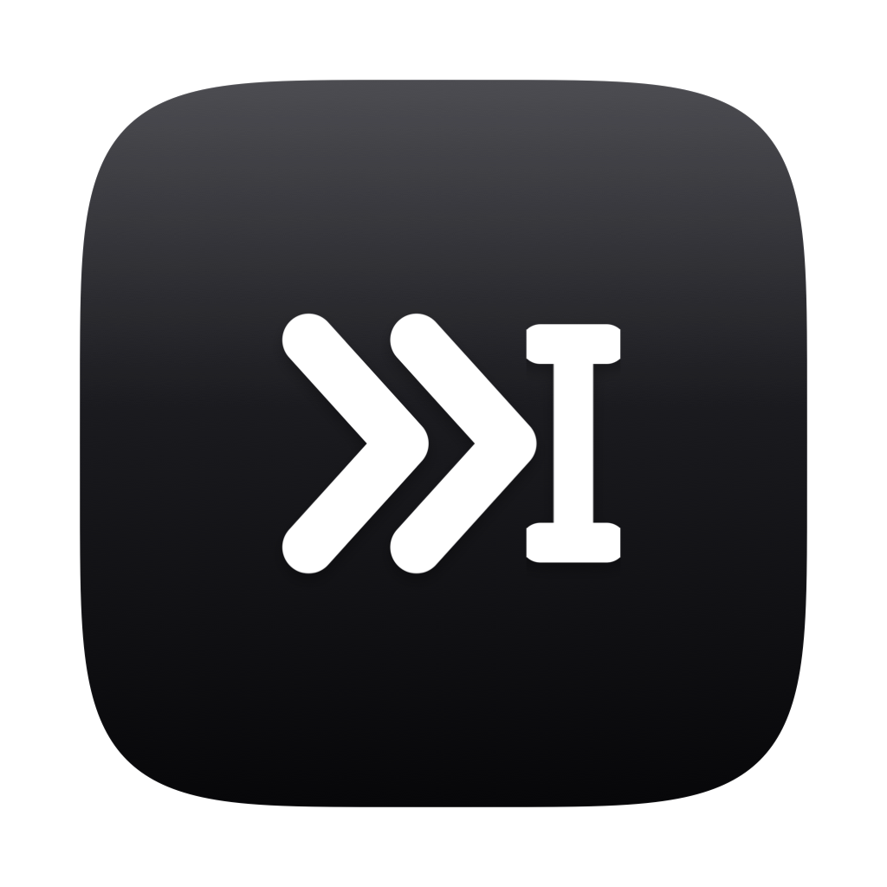
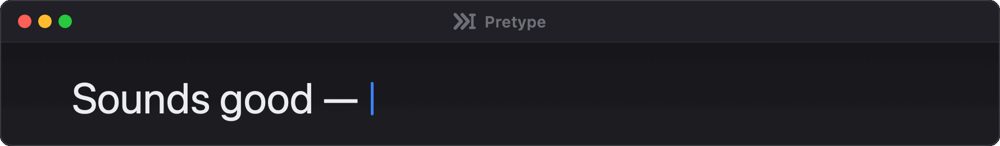
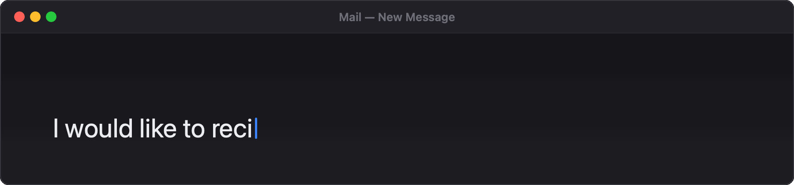
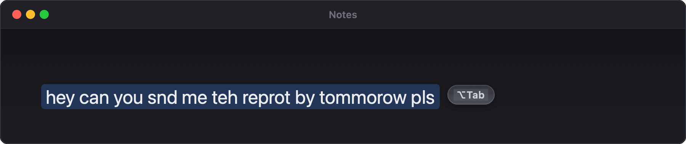
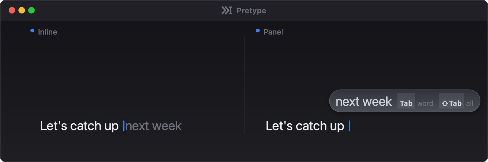
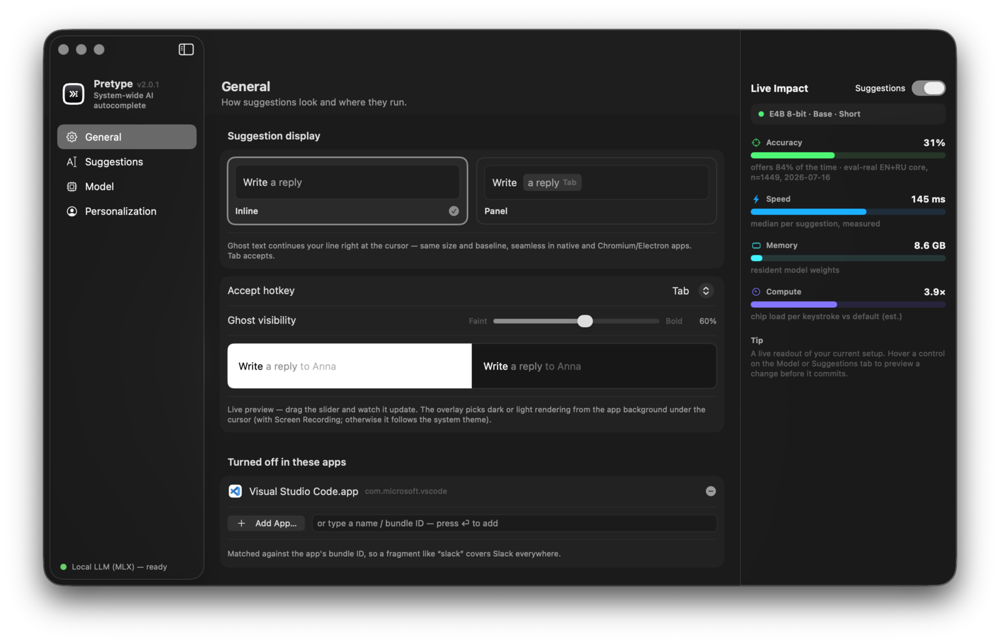
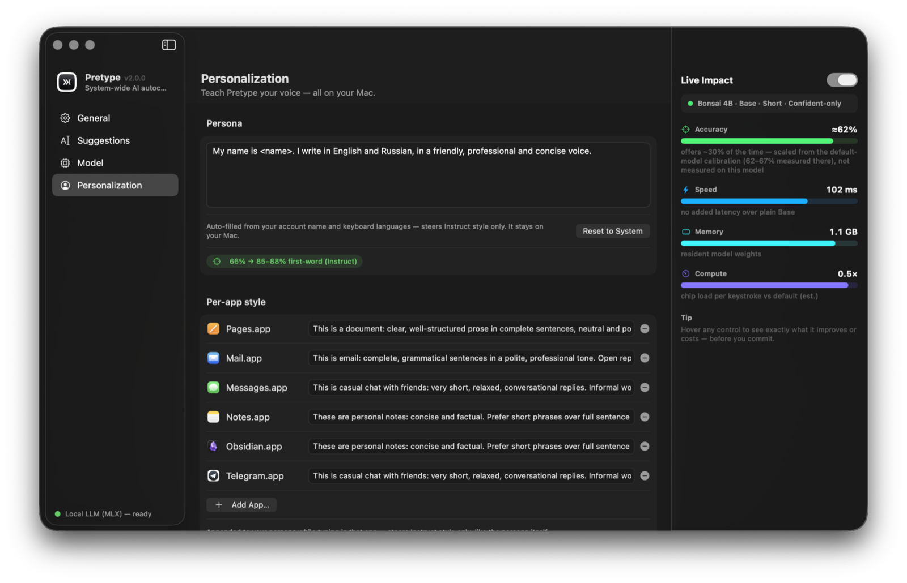
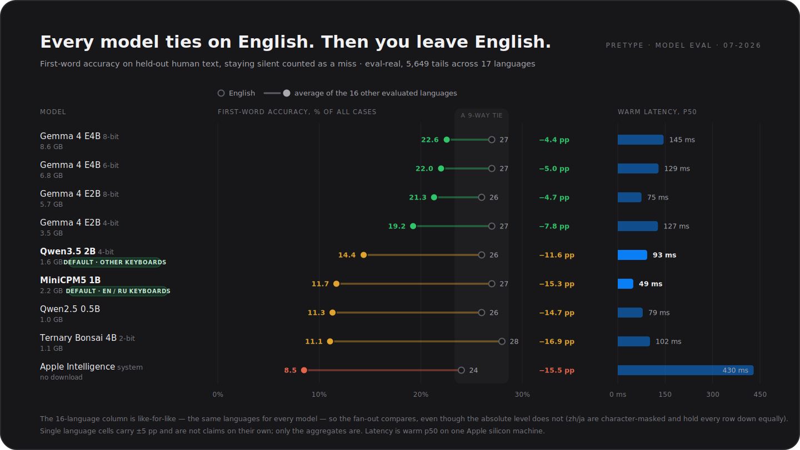
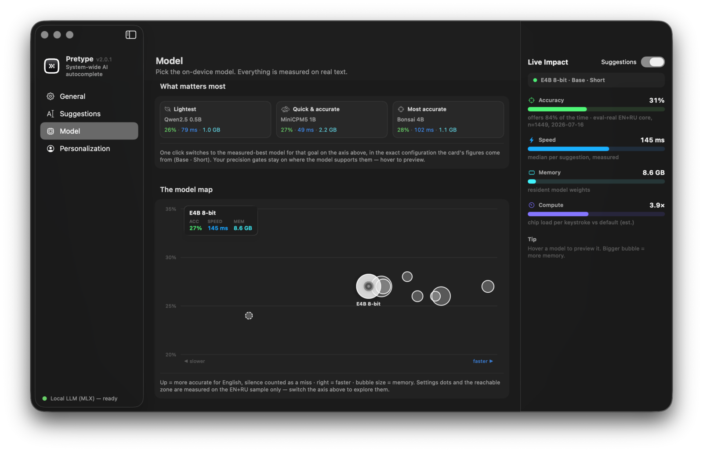
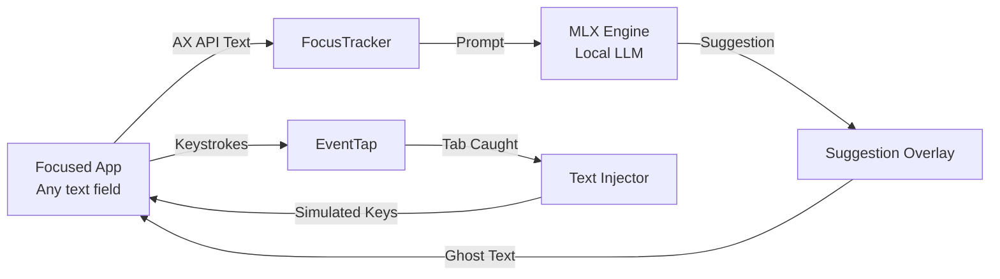

<div align="center">

<picture>
  <source media="(prefers-color-scheme: dark)" srcset="docs/pretype-logo-dark.png" />
  
</picture>

# Pretype

**System-wide AI autocomplete for macOS.**<br/>
Copilot-style suggestions in every text field — offline, private, and on-device.

[](https://github.com/nikiomori/Pretype/releases/latest)
[](https://github.com/nikiomori/Pretype/actions/workflows/ci.yml)
[](LICENSE)
[](#requirements)
[](https://pretype.app)

<p>
  <a href="#features"><b>Features</b></a> ·
  <a href="#quick-start"><b>Quick Start</b></a> ·
  <a href="#choosing-a-model"><b>Models</b></a> ·
  <a href="#privacy--permissions"><b>Privacy</b></a> ·
  <a href="#faq"><b>FAQ</b></a>
</p>

<a href="https://github.com/nikiomori/Pretype/releases/latest/download/Pretype.app.zip">
  
</a>

<br/><br/>



<sub>*Type anywhere → the local model answers → <kbd>Tab</kbd> takes a word, <kbd>⇧Tab</kbd> takes the rest.*</sub>

</div>

---

> [!IMPORTANT]
> **What it needs, and what leaves your Mac.** Pretype needs the **Accessibility** permission — the same grant a keylogger would ask for — to read the focused text field, catch the accept key, and type suggestions back. Nothing you type is ever uploaded: completions run on a local model, and the app makes only two kinds of network request — model weights from Hugging Face, and a once-a-day version check against the GitHub Releases API that sends nothing about you (off in **Settings → General**).
>
> Don't take that on faith. The entire input path is three files worth reading: [`AXText.swift`](Sources/Pretype/AXText.swift) reads the field, [`KeyTap.swift`](Sources/Pretype/KeyTap.swift) watches for the accept key, [`TextInjector.swift`](Sources/Pretype/TextInjector.swift) types back. Everything the app stores is listed under [Privacy & Permissions](#privacy--permissions), and [Uninstall](#uninstall) removes all of it.

## Why Pretype?

Most autocomplete lives inside a single editor and ships your text to a server. Pretype works in every macOS text field — Mail, Slack, Notes, Safari, VS Code — and never leaves your machine. No account, no subscription, no API key.

It's a free, MIT-licensed alternative to [Cotypist](https://cotypist.app) — a from-scratch reimplementation of the same idea, not affiliated with it.

---

## Features

* **Any text field** — native AppKit/SwiftUI apps, Electron apps (VS Code, Slack, Claude Desktop), and web views.
* **Ghost text at the caret** — baseline-matched and sized to the field's own font, or a floating panel if you prefer that.
* **<kbd>Tab</kbd> to accept** — one word at a time, <kbd>⇧Tab</kbd> for the rest, or just keep typing to reject. The part one <kbd>Tab</kbd> will take renders a step brighter. Switchable to <kbd>⌘Space</kbd>, <kbd>⌥Space</kbd> or <kbd>⌃Space</kbd> in Settings.
* **Inline typo fixes** — a correction pill above the misspelled word, <kbd>Tab</kbd> to apply. Uses the macOS spell-checker in whichever language it detects from the surrounding text.
* **Emoji shortcodes** — type `:shrug:` and 🤷 is offered in the same pill, <kbd>Tab</kbd> to take it. A handful of Gemoji nicknames plus every Unicode character name macOS already knows, so `:rocket:` and `:thinking_face:` work without shipping a table.
* **Rewrites (<kbd>⌥Tab</kbd>)** — select clumsy text and the local model fixes grammar, typos and phrasing in place, keeping your tone. With nothing selected it fixes the word you just typed. On some models this needs a separate instruct sibling, downloaded once on first use (≈2.2 GB on the English/Russian default, up to ≈5 GB on Gemma; the menu bar shows *preparing…*).
* **Fast** — 49–145 ms warm completions across the local models, by prefilling only the newly typed tokens and reusing the KV cache.
* **Knows where it is** — adapts per app, stays out of terminals and password managers, and stops reading entirely while macOS reports secure input. Optional on-screen OCR pulls in surrounding context.
* **Sounds like you** — one persona plus per-app style instructions, learned from a local journal you can clear or switch off at any time.

---

## Quick Start

### Download the app *(recommended)*

1. **Apple Silicon only** (M1 or newer) — MLX does not run on Intel Macs. Grab [`Pretype.app.zip`](https://github.com/nikiomori/Pretype/releases/latest/download/Pretype.app.zip) from [Releases](https://github.com/nikiomori/Pretype/releases), unzip, and move `Pretype.app` to `/Applications`.
2. Clear the quarantine flag. Releases are ad-hoc signed and not notarized, so Gatekeeper blocks the first launch — expected, not a warning sign:
   ```bash
   xattr -dr com.apple.quarantine /Applications/Pretype.app
   ```
   *(Or open it via **System Settings → Privacy & Security → Open Anyway**.)* Developer ID signing is planned; until then an in-place updater would change the code signature and make macOS revoke the Accessibility grant the app runs on, so updates stay manual.
3. Launch it and **grant Accessibility** when prompted. If you grant it after launching, restart the app.
4. On first launch Pretype downloads one model from Hugging Face (**≈1.6–2.2 GB**, picked to match your keyboard languages — the menu-bar icon shows progress).
5. Pretype lives in the **menu bar** — no Dock icon, no main window. Click the icon for status, **Diagnostics**, and **Settings…** (<kbd>⌘,</kbd>).

### Build from source

> [!NOTE]
> Requires **full Xcode 26 or newer** — the Apple Intelligence engine imports the `FoundationModels` framework, which is absent from Xcode 16.x, and the MLX engine needs the Metal compiler. Command Line Tools alone are not enough. The prebuilt app above needs none of this.

```bash
xcodebuild -downloadComponent MetalToolchain      # once

git clone https://github.com/nikiomori/Pretype.git && cd Pretype
./Scripts/make-app.sh                             # builds build/Pretype.app
open build/Pretype.app
```

Dev loop, headless harnesses and the SwiftPM/Metal caveat live in the [Contributing Guide](CONTRIBUTING.md#development-setup).

---

## In Action

<div align="center">


<p><sub><i><b>Inline typo fix.</b> <kbd>Tab</kbd> applies it, <kbd>Esc</kbd> dismisses.</i></sub></p>

<br/>


<p><sub><i><b>Rewrite (<kbd>⌥Tab</kbd>).</b> <kbd>⏎</kbd> takes the rewrite, <kbd>Esc</kbd> keeps your original.</i></sub></p>

<br/>


<p><sub><i><b>Two presentation modes.</b> Inline ghost text stays pixel-accurate even in Electron apps.</i></sub></p>

<br/>


<p><sub><i><b>Settings show their cost.</b> Hover any option and the accuracy / speed / memory / compute meters preview the change before you commit it.</i></sub></p>

<br/>


<p><sub><i><b>Your voice, per app.</b> Formal prose in Mail, short replies in Messages.</i></sub></p>

</div>

---

## Choosing a Model

Every model in the catalog — plus the Apple Intelligence system model — is measured on the same held-out eval: first-word accuracy on real human text, where staying silent counts as a miss.

<div align="center">

</div>

* **Typing in English?** No model measurably beats another — all nine land between 24% and 28%, inside the ±5 pp a single-language cell carries. So pick on speed and size: MiniCPM5 1B is the fastest in the catalog at 49 ms.
* **Typing in anything else?** The tie collapses. The Gemma 4 tiers give up 4–8 points; MiniCPM5, Bonsai and Qwen 0.5B give up more than half of what they scored on English. **Qwen3.5 2B** sags least of the small models and is the best sub-2 GB pick — it beats Bonsai, Qwen 0.5B and the larger MiniCPM5 (all p<0.001).
* **Tight on RAM?** Qwen2.5 0.5B runs in ≈1 GB and stays with the pack on English.
* **Tempted by Apple Intelligence?** It's the only option with no download and no app memory (macOS 26+) — but it's last on both axes here: 430 ms against 49–145 ms, and the steepest multilingual drop in the chart. Polish, Romanian and Czech are outside its supported set entirely.

That split is why the default is chosen from your keyboard layouts — **MiniCPM5 1B** for English/Russian typists, **Qwen3.5 2B** for everyone else. Everything else is one click in **Settings → Model**, where each entry ships its own eval-backed recommended settings and the catalog re-ranks for any of the 17 evaluated languages.

<div align="center">

<p><sub><i>The same data live in the app — a speed × accuracy map with one-click presets and a per-language accuracy axis.</i></sub></p>
</div>

<sub>Chart method: equal-weight mean over `cs de es fr it ja ko nl pl pt ro ru sv tr uk zh`, matched register cells only. Absolute values are not comparable *between* languages (zh/ja are character-masked), so the mean measures spread across languages, not skill at any one of them. Single-language cells carry ±5 pp and are not claims on their own.</sub>

---

## How It Works



1. **FocusTracker** follows the focused text element via `AXObserver` and reads the text around the caret on each keystroke.
2. The **CompletionEngine** — a local MLX model, debounced and cancellable — returns a short continuation, or stays silent.
3. **SuggestionWindow** draws the ghost text, size- and baseline-matched to the caret.
4. A **CGEventTap** catches the accept key. If you take the suggestion, **TextInjector** types it into the active app as synthetic key events.

Engines, the model catalog, quantization tiers, and the KV-cache and gating details are in [docs/ARCHITECTURE.md](docs/ARCHITECTURE.md).

---

## Privacy & Permissions

| | |
|---|---|
| **Your text** | Never uploaded. Every completion is computed on-device, by a local MLX model or the Apple Intelligence system model. |
| **Network** | Two things only: model weights from Hugging Face (on first launch, plus a small instruct sibling the first time you use <kbd>⌥Tab</kbd>), and a once-a-day GitHub Releases version check that sends nothing about you. Turn the latter off in **Settings → General**. |
| **Accessibility** *(required)* | How Pretype reads the focused field, catches the accept key, and types text back. There is no way to do this without it. |
| **Screen Recording** *(optional, off)* | Only for on-screen OCR context, and only for the focused window. OCR'd text and clipboard contents are redacted from the debug log — an exported log carries a character count in their place, never the text. |
| **Stored locally** | A journal of suggestions and short snippets of surrounding text in `~/Library/Application Support/Pretype`, capped at 50 MB, used for on-device personalization — plus any text you import yourself via **Settings → Personalization → Import Text…**. Turning the journal off deletes all of it, imported passages included. |
| **Never runs** | In terminals and password managers, while macOS reports secure input, and while an input method is mid-composition (Pinyin, kana, Telex, Hangul). Add your own apps to the blacklist in **Settings → General**, or silence the app you're in straight from the menu bar. |

---

## Troubleshooting

Open **Diagnostics** from the menu-bar icon — *Context* shows what Pretype sees (app, window, field) and *Pipeline* shows what the last completion did.

<details>
<summary><b>Common issues</b></summary>

<br/>

* **`Accessibility: NOT granted ✗`** — if you're running the raw binary from a terminal, macOS attributes the permission to the *terminal*, so grant it there or run the `.app` bundle. If you built locally, a changed code signature can confuse macOS: `tccutil reset Accessibility app.pretype.Pretype`, then re-grant.
* **`Text element: none`** — the app doesn't expose its text fields over the Accessibility API. Nothing to be done from this side.
* **`Last: engine returned no suggestion`** — the model had nothing it was willing to guess: too little context, or the output gates rejected what it produced. Keep typing.
* **No suggestions anywhere, MLX engine missing** — a source build without compiled Metal shaders. Use `./Scripts/make-app.sh` rather than plain `swift build`.

</details>

---

## FAQ

<details>
<summary><b>What happens to <kbd>Tab</kbd> when I actually want a Tab?</b></summary>
<br/>

It passes straight through. The event tap only swallows the key while a suggestion is on screen; with nothing showing, <kbd>Tab</kbd> indents and moves between fields as usual. If that still collides with your habits, switch the chord to <kbd>⌘Space</kbd>, <kbd>⌥Space</kbd> or <kbd>⌃Space</kbd> in **Settings → General**.
</details>

<details>
<summary><b>What does it cost in battery and memory?</b></summary>
<br/>

The model stays resident while you're typing — that's what makes warm completions fast — holding ≈1.6–2.2 GB for the defaults. After **five idle minutes it unloads itself** and frees that memory, reloading on your next keystroke; it also unloads early if macOS reports memory pressure. It only computes while you're typing in a field it's allowed to read, and suggestions are debounced and cancellable, so fast typing supersedes in-flight work instead of queueing it.
</details>

<details>
<summary><b>Which languages work?</b></summary>
<br/>

Completions are evaluated across 17 languages — see [Choosing a Model](#choosing-a-model); the default is picked from your keyboard layouts and the Gemma 4 builds have the broadest coverage. Inline typo fixes use the macOS spell-checker in whichever language it detects, so any dictionary macOS has installed works (English and Russian are the most-tested pair).
</details>

---

## Requirements

* **OS** — macOS 14+ (macOS 26+ for the Apple Intelligence engine)
* **Hardware** — Apple Silicon (M1 or newer). Intel Macs can't run MLX at all.
* **Memory** — 8 GB is enough; the defaults hold ≈1.6–2.2 GB resident, and the catalog goes down to ≈1 GB. Big-RAM Macs can pick Gemma 4 E4B 8-bit at ≈8.6 GB.
* **Storage** — ≈1.6–2.2 GB for the default model; 1–8.6 GB depending on what you pick. Using <kbd>⌥Tab</kbd> can add a one-time instruct sibling (≈2.2 GB on the EN/RU default, up to ≈5 GB on Gemma; none on Qwen3.5 or Bonsai, which correct with themselves)
* **To build** — full Xcode 26+ (macOS 26 SDK + Metal toolchain). Not needed for the prebuilt app.

---

## Uninstall

Pretype keeps everything in four places — remove them all and no trace remains:

```bash
# 1. The app. If you turned on "Open at login", switch it off FIRST (Settings →
#    General, or System Settings → General → Login Items) — that registration
#    lives in macOS, not in the app, and deleting the bundle leaves it behind.
rm -rf /Applications/Pretype.app

# 2. Downloaded models (several GB). Settings → Model lists each one with its
#    size and a Delete button, which only ever touches Pretype's own catalog —
#    but it never offers the model you're currently using, so for a FULL wipe
#    when uninstalling, use the globs. They are the blunt version: they match
#    the WHOLE mlx-community / openbmb / prism-ml orgs in the shared Hugging
#    Face cache. Skip this step if any other MLX tool (LM Studio, mlx_lm, …)
#    uses it.
rm -rf ~/.cache/huggingface/hub/models--openbmb--* \
       ~/.cache/huggingface/hub/models--mlx-community--* \
       ~/.cache/huggingface/hub/models--prism-ml--*

# 3. Local personalization data (suggestion journal, learned n-grams)
rm -rf ~/Library/Application\ Support/Pretype

# 4. Settings and the Accessibility grant
defaults delete app.pretype.Pretype
tccutil reset Accessibility app.pretype.Pretype
```

---

## Contributing

Pretype is young and moving fast — bug reports, ideas and pull requests are all welcome.

* [Open an issue](https://github.com/nikiomori/Pretype/issues) for bugs and feature requests
* Read the [Contributing Guide](CONTRIBUTING.md) and [Code of Conduct](CODE_OF_CONDUCT.md)
* Report security issues privately per [SECURITY.md](SECURITY.md)

If Pretype is useful to you, a ⭐ helps others find it.

## Acknowledgements

[MLX](https://github.com/ml-explore/mlx) and [mlx-swift-lm](https://github.com/ml-explore/mlx-swift-lm) — Apple's on-device ML stack · [MiniCPM](https://huggingface.co/openbmb) and [Qwen](https://huggingface.co/Qwen) — the default models · [Gemma](https://ai.google.dev/gemma) — the heavy-duty option · [swift-transformers](https://github.com/huggingface/swift-transformers) — tokenizers and hub client · [Cotypist](https://cotypist.app) — the original inspiration.

## License

MIT — free for personal and commercial use. Bundled libraries and downloadable model weights carry their own licenses; see [THIRD_PARTY_NOTICES.md](THIRD_PARTY_NOTICES.md).
