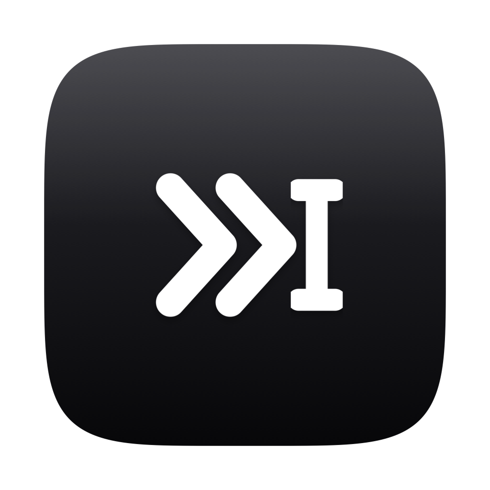
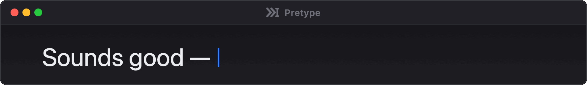
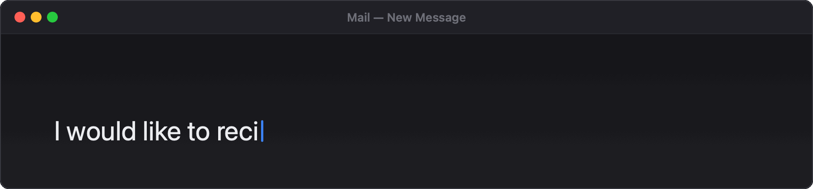
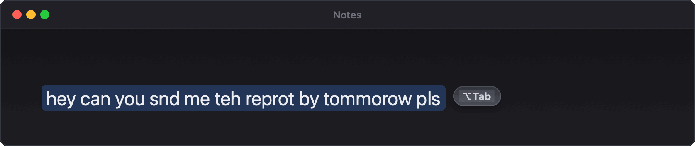
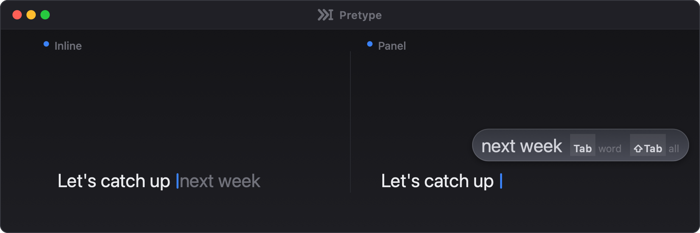
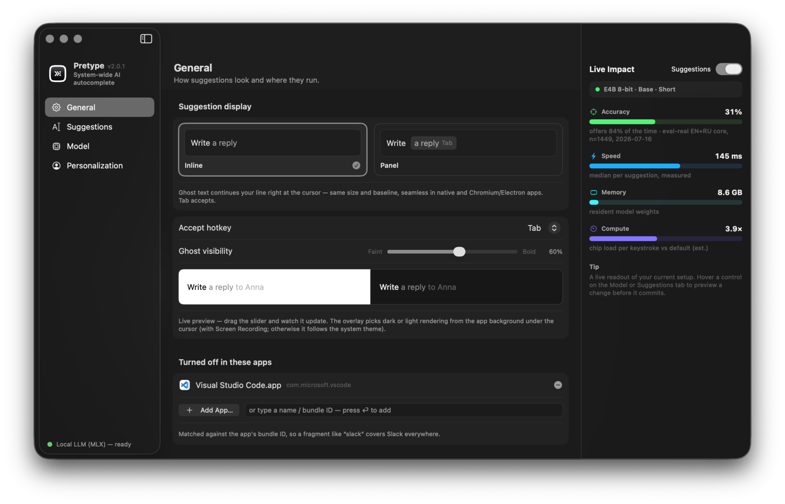
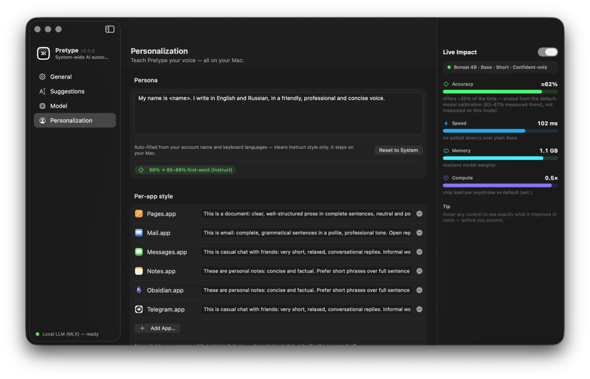
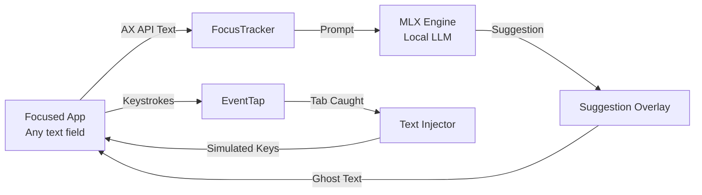

<div align="center">

<picture>
  <source media="(prefers-color-scheme: dark)" srcset="docs/pretype-logo-dark.png" />
  
</picture>

# Pretype

**System-wide AI autocomplete for macOS.**<br/>
Copilot-style suggestions in every text field — offline, private, and on-device.

[](https://github.com/nikiomori/Pretype/releases/latest)
[](https://github.com/nikiomori/Pretype/actions/workflows/ci.yml)
[](LICENSE)
[](#requirements)
[](https://pretype.app)

<p>
  <a href="#features"><b>Features</b></a> ·
  <a href="#quick-start"><b>Quick Start</b></a> ·
  <a href="docs/models.md"><b>Models</b></a> ·
  <a href="docs/privacy.md"><b>Privacy</b></a> ·
  <a href="docs/troubleshooting.md#faq"><b>FAQ</b></a>
</p>

<a href="https://github.com/nikiomori/Pretype/releases/latest/download/Pretype.app.zip">
  
</a>

<br/><br/>



<sub>*Type anywhere → the local model answers → <kbd>Tab</kbd> takes a word, <kbd>⇧Tab</kbd> takes the rest.*</sub>

</div>

---

> [!IMPORTANT]
> **What it needs, and what leaves your Mac.** Pretype needs the **Accessibility** permission — the same grant a keylogger would ask for — to read the focused text field, catch the accept key, and type suggestions back. Nothing you type is ever uploaded: completions run on a local model, and the app makes only two kinds of network request — model weights from Hugging Face, and a once-a-day version check against the GitHub Releases API that sends nothing about you (off in **Settings → General**).
>
> Don't take that on faith. The entire input path is three files worth reading: [`AXText.swift`](Sources/Pretype/AXText.swift) reads the field, [`KeyTap.swift`](Sources/Pretype/KeyTap.swift) watches for the accept key, [`TextInjector.swift`](Sources/Pretype/TextInjector.swift) types back. Everything the app stores, and how to remove all of it, is in [Privacy & permissions](docs/privacy.md).

## Why Pretype?

Most autocomplete lives inside a single editor and ships your text to a server. Pretype works in every macOS text field — Mail, Slack, Notes, Safari, VS Code — and never leaves your machine. No account, no subscription, no API key.

It's a free, MIT-licensed alternative to [Cotypist](https://cotypist.app) — a from-scratch reimplementation of the same idea, not affiliated with it.

---

## Features

* **Any text field** — native AppKit/SwiftUI apps, Electron apps (VS Code, Slack, Claude Desktop), and web views.
* **Ghost text at the caret** — baseline-matched and sized to the field's own font, or a floating panel if you prefer that.
* **<kbd>Tab</kbd> to accept** — one word at a time, <kbd>⇧Tab</kbd> for the rest, or just keep typing to reject. The part one <kbd>Tab</kbd> will take renders a step brighter. Switchable to <kbd>⌘Space</kbd>, <kbd>⌥Space</kbd> or <kbd>⌃Space</kbd> in Settings.
* **Inline typo fixes** — a correction pill above the misspelled word, <kbd>Tab</kbd> to apply. Uses the macOS spell-checker in whichever language it detects from the surrounding text.
* **Emoji shortcodes** — type `:shrug:` and 🤷 is offered in the same pill, <kbd>Tab</kbd> to take it. A handful of Gemoji nicknames plus every Unicode character name macOS already knows, so `:rocket:` and `:thinking_face:` work without shipping a table.
* **Rewrites (<kbd>⌥Tab</kbd>) and reply drafts (<kbd>⌥⇧Tab</kbd>)** — select clumsy text and the local model fixes grammar, typos and phrasing in place, keeping your tone; with nothing selected it fixes the word you just typed. Add <kbd>⇧</kbd> (or double-tap a modifier) and it drafts your next message from the conversation on screen instead. Both are measured per model — the strongest sibling restores 65% of noisy lines byte-exactly — and both tasks have *opposite* winners, so [Choosing a model](docs/models.md#fixing-and-replying) has the table. On some models this needs a separate instruct sibling, downloaded once on first use (≈2.2 GB on MiniCPM5, up to ≈5 GB on a base-style Gemma; the menu bar shows *preparing…*).
* **Fast** — 49–145 ms warm completions across the local models, by prefilling only the newly typed tokens and reusing the KV cache.
* **Knows where it is** — adapts per app, stays out of terminals and password managers, and stops reading entirely while macOS reports secure input. Where you almost never take its suggestions it goes quiet by itself, and says so in the menu with the numbers and a one-click *Resume*. Optional on-screen OCR pulls in surrounding context.
* **Sounds like you** — one persona plus per-app style instructions, learned from a local journal you can clear or switch off at any time.

---

## Quick Start

### Homebrew *(recommended)*

```bash
brew install --no-quarantine nikiomori/tap/pretype
```

**Apple Silicon only** (M1 or newer) — MLX does not run on Intel Macs. `--no-quarantine` skips the Gatekeeper "Open Anyway" dance (releases are ad-hoc signed, not notarized — see step 2 below); to keep skipping it on every `brew upgrade`, put `export HOMEBREW_CASK_OPTS="--no-quarantine"` in your shell profile. Then continue from step 3.

### Download the app

1. **Apple Silicon only** (M1 or newer). Grab [`Pretype.app.zip`](https://github.com/nikiomori/Pretype/releases/latest/download/Pretype.app.zip) from [Releases](https://github.com/nikiomori/Pretype/releases), unzip, and move `Pretype.app` to `/Applications`.
2. Clear the quarantine flag. Releases are ad-hoc signed and not notarized, so Gatekeeper blocks the first launch — expected, not a warning sign:
   ```bash
   xattr -dr com.apple.quarantine /Applications/Pretype.app
   ```
   *(Or open it via **System Settings → Privacy & Security → Open Anyway**.)* Developer ID signing is planned; until then an in-place updater would change the code signature and make macOS revoke the Accessibility grant the app runs on, so updates stay manual.
3. Launch it and **grant Accessibility** when prompted. If you grant it after launching, restart the app.
4. On first launch Pretype downloads one model from Hugging Face (**≈1.6–6.8 GB, sized to your Mac's memory** — the strongest tier that stays within about a quarter of it; the menu-bar icon shows progress). Any other model is one click in **Settings → Model**; [Choosing a model](docs/models.md) has the eval numbers behind the default.
5. Pretype lives in the **menu bar** — no Dock icon, no main window. Click the icon for status, **Diagnostics**, and **Settings…** (<kbd>⌘,</kbd>).

### Build from source

> [!NOTE]
> Requires **full Xcode 26 or newer** — the Apple Intelligence engine imports the `FoundationModels` framework, which is absent from Xcode 16.x, and the MLX engine needs the Metal compiler. Command Line Tools alone are not enough. The prebuilt app above needs none of this.

```bash
xcodebuild -downloadComponent MetalToolchain      # once

git clone https://github.com/nikiomori/Pretype.git && cd Pretype
./Scripts/make-app.sh                             # builds build/Pretype.app
open build/Pretype.app
```

Dev loop, headless harnesses and the SwiftPM/Metal caveat live in the [Contributing Guide](CONTRIBUTING.md#development-setup).

---

## In Action

<div align="center">


<p><sub><i><b>Inline typo fix.</b> <kbd>Tab</kbd> applies it, <kbd>Esc</kbd> dismisses.</i></sub></p>

<br/>


<p><sub><i><b>Rewrite (<kbd>⌥Tab</kbd>).</b> <kbd>⏎</kbd> takes the rewrite, <kbd>Esc</kbd> keeps your original.</i></sub></p>

<br/>


<p><sub><i><b>Two presentation modes.</b> Inline ghost text stays pixel-accurate even in Electron apps.</i></sub></p>

<br/>


<p><sub><i><b>Settings show their cost.</b> Hover any option and the accuracy / speed / memory / compute meters preview the change before you commit it.</i></sub></p>

<br/>


<p><sub><i><b>Your voice, per app.</b> Formal prose in Mail, short replies in Messages.</i></sub></p>

</div>

---

## How It Works


```mermaid
flowchart LR
    App["Focused App<br/>Any text field"] -->|AX API Text| FocusTracker
    FocusTracker -->|Prompt| MLX["MLX Engine<br/>Local LLM"]
    MLX -->|Suggestion| Window[Suggestion Overlay]
    Window -->|Ghost Text| App
    App -->|Keystrokes| EventTap
    EventTap -->|Tab Caught| Injector[Text Injector]
    Injector -->|Simulated Keys| App
```

1. **FocusTracker** follows the focused text element via `AXObserver` and reads the text around the caret on each keystroke.
2. The **CompletionEngine** — a local MLX model, debounced and cancellable — returns a short continuation, or stays silent.
3. **SuggestionWindow** draws the ghost text, size- and baseline-matched to the caret.
4. A **CGEventTap** catches the accept key. If you take the suggestion, **TextInjector** types it into the active app as synthetic key events.

---

## Documentation

Rendered at **[pretype.app/docs](https://pretype.app/docs)**, written in [`docs/`](docs/).

| | |
|---|---|
| [**Architecture**](docs/ARCHITECTURE.md) | Engines, the model catalog, quantization tiers, the KV cache, and how the app decides to stay quiet |
| [**Choosing a model**](docs/models.md) | The eval behind the defaults, what each tier costs in RAM and latency, and how to pick for your languages |
| [**Privacy & permissions**](docs/privacy.md) | Every permission and why it's needed, what's stored on disk, and how to uninstall completely |
| [**Troubleshooting & FAQ**](docs/troubleshooting.md) | Reading Diagnostics, the common failure modes, and the questions that keep coming up |
| [**Fine-tuning**](docs/finetuning.md) | Training a small base model on your own writing, end to end on your Mac |

---

## Requirements

* **OS** — macOS 14+ (macOS 26+ for the Apple Intelligence engine)
* **Hardware** — Apple Silicon (M1 or newer). Intel Macs can't run MLX at all.
* **Memory** — 8 GB is enough; the default is sized to about a quarter of your Mac's memory (≈1.6 GB resident on 8 GB Macs up to ≈6.8 GB from 32 GB), and the catalog goes down to ≈1 GB. Big-RAM Macs can pick Gemma 4 E4B 8-bit at ≈8.6 GB.
* **Storage** — ≈1.6–6.8 GB for the default model (sized to your Mac); 1–8.6 GB depending on what you pick. Using <kbd>⌥Tab</kbd> can add a one-time instruct sibling (≈2.2 GB on MiniCPM5, up to ≈5 GB on a base-style Gemma; none on Qwen3.5 or Bonsai, which correct with themselves, or on a Gemma in its recommended Instruct style)
* **To build** — full Xcode 26+ (macOS 26 SDK + Metal toolchain). Not needed for the prebuilt app.

---

## Contributing

Pretype is young and moving fast — bug reports, ideas and pull requests are all welcome.

* [Open an issue](https://github.com/nikiomori/Pretype/issues) for bugs and feature requests
* Read the [Contributing Guide](CONTRIBUTING.md) and [Code of Conduct](CODE_OF_CONDUCT.md)
* Report security issues privately per [SECURITY.md](SECURITY.md)

If Pretype is useful to you, a ⭐ helps others find it.

## Acknowledgements

[MLX](https://github.com/ml-explore/mlx) and [mlx-swift-lm](https://github.com/ml-explore/mlx-swift-lm) — Apple's on-device ML stack · [MiniCPM](https://huggingface.co/openbmb) and [Qwen](https://huggingface.co/Qwen) — the default models · [Gemma](https://ai.google.dev/gemma) — the heavy-duty option · [swift-transformers](https://github.com/huggingface/swift-transformers) — tokenizers and hub client · [Cotypist](https://cotypist.app) — the original inspiration.

## License

MIT — free for personal and commercial use. Bundled libraries and downloadable model weights carry their own licenses; see [THIRD_PARTY_NOTICES.md](THIRD_PARTY_NOTICES.md).
