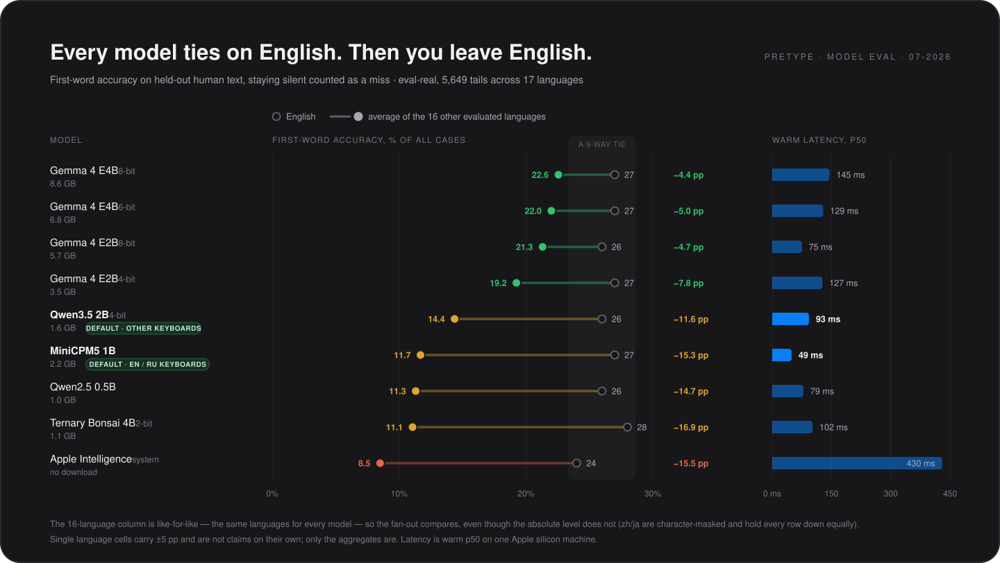

# Choosing a model

Every model in the catalog — plus the Apple Intelligence system model — is measured on the same held-out eval: first-word accuracy on real human text, where staying silent counts as a miss.

* **Typing in English?** No model measurably beats another — all nine land between 24% and 28%, inside the ±5 pp a single-language cell carries. So pick on speed and size: MiniCPM5 1B is the fastest in the catalog at 49 ms.
* **Typing in anything else?** The tie collapses. The Gemma 4 tiers give up 4–8 points; MiniCPM5, Bonsai and Qwen 0.5B give up more than half of what they scored on English. **Qwen3.5 2B** sags least of the small models and is the best sub-2 GB pick — it beats Bonsai, Qwen 0.5B and the larger MiniCPM5 (all p<0.001).
* **Typing in Russian?** Not the same question as English, which is why the two are never averaged into one figure here. Every small model is stronger in English than in Russian: MiniCPM5 ties Gemma E2B 8-bit on English (27% vs 26%, p=0.35) and gives up 6 points on Russian (17% vs 23%, p<0.001). It stays the recommendation for Russian anyway — nothing in its weight class beats it there (Qwen3.5 2B ties it, p=0.79) — but if you have the memory, a Gemma tier is a real upgrade for Russian in a way it isn't for English.
* **Tight on RAM?** Qwen2.5 0.5B runs in ≈1 GB and stays with the pack on English.
* **Arabic or Hebrew?** Measured separately (560 held-out rows, 2026-07-25) and it is the hardest ground in the catalog. Every small model lands at 4–10% and they are statistically tied with each other, so the sub-2 GB default is as good as that tier gets; a Gemma tier roughly doubles it (E2B 8-bit: 11% Arabic, 18% Hebrew) and is worth the RAM if you have it. Two traps: MiniCPM5 is effectively blind in Hebrew (1%), and Apple Intelligence answers *more* often than any downloadable model (86% of the time) while being right on 4–6%. Inline typo fixes are inert in both languages — macOS lists them as spell-check languages but ships no dictionary.
* **Tempted by Apple Intelligence?** It's the only option with no download and no app memory (macOS 26+) — but it's last on both axes here: 430 ms against 49–145 ms, and the steepest multilingual drop in the chart. Polish, Romanian and Czech are outside its supported set entirely.

That split is why the default is chosen from your keyboard layouts — **MiniCPM5 1B** for English/Russian typists, **Qwen3.5 2B** for everyone else. Everything else is one click in **Settings → Model**, where each entry ships its own eval-backed recommended settings and the catalog re-ranks for any of the 19 evaluated languages.

<i>The same data live in the app — a speed × accuracy map with one-click presets and a per-language accuracy axis.</i>

Chart method: equal-weight mean over `cs de es fr it ja ko nl pl pt ro ru sv tr uk zh`, matched register cells only (Arabic and Hebrew were measured later, on their own set, and are not in this chart). Absolute values are not comparable *between* languages (zh/ja are character-masked), so the mean measures spread across languages, not skill at any one of them. Every language cell is 280 held-out rows — English 560, Russian 689 — which is ±5 pp near 20% and ±3 pp at Russian's size; a gap smaller than that is not a result. The app shows the same tolerance and sample size beside each figure, and lets you pick any single language as the axis rather than reading an average.

## What a model costs you

Disk and memory track each other: the defaults hold **≈1.6–2.2 GB** resident, the catalog goes down to ≈1 GB, and Gemma 4 E4B 8-bit sits at ≈8.6 GB. Warm completions run **49–145 ms** across the local models, against 430 ms for Apple Intelligence, which downloads nothing and holds no app memory at all.

That resident figure is what a model holds *while you type*, not all day: it unloads itself after five idle minutes and reloads on your next keystroke, and unloads early if macOS reports memory pressure. Using <kbd>⌥Tab</kbd> rewrites can add a one-time instruct sibling on some models — ≈2.2 GB on the EN/RU default, up to ≈5 GB on Gemma, none on Qwen3.5 or Bonsai, which correct with themselves.

Quantization tiers, the engine split and the confidence gate are in [Architecture](ARCHITECTURE.md). Training a model on your own writing is in [Fine-tuning](finetuning.md).
